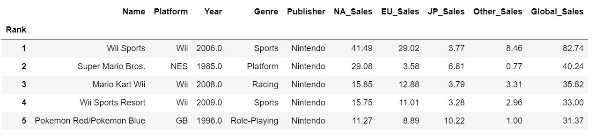
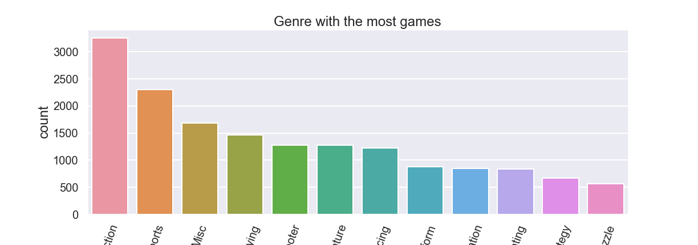
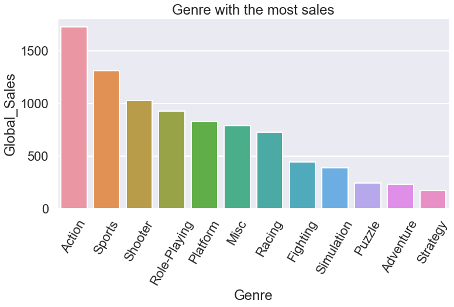

# Analysis and visualization of Video games sales dataset
## Selma Laarabi
## 1.Introduction
- In this Readme file we're going through the analysis of a video games sales dataset, as well as enriching it with demographic data using API's.
- the sources used for this analysis :
   * Dataset from  https://www.kaggle.com/datasets
   * API from https://data.worldbank.org/indicator/SP.DYN.CBRT.IN
## 2.Describing the Data set
The data set used in this project contains information about the release and sales of video games in 4 different regions (North America, EU, Japan, and others),
as well as information about games genre and publishers, over the years from 1980 until 2020.  

    * What is a video game?
A video game is an electronic game that can be played on a computing device, such as a personal computer, gaming console. Depending on the platform, video games can be subcategorized into computer games and console games. In recent years, however, the emergence of social networks, smartphones and tablets introduced new categories such as mobile and social games. Video games have come a long way since the first games emerged in the 1970s. 
Our dataset does not include mobile platform.  

     * Dataset fields and data types are:
 - Rank - Ranking of overall sales, integer.
 - Name - The games name.
 - Platform - Platform of the games release (i.e. PC,Wii,PS2 etc.), object.
 - Year - Year of the game's release, float.
 - Genre - Genre of the game ,object.
 - Publisher - Publisher of the game, object.
 - NA_Sales - Sales in North America (in millions), float.
 - EU_Sales - Sales in Europe (in millions), float.
 - JP_Sales - Sales in Japan (in millions), float.
 - Other_Sales - Sales in the rest of the world (in millions), float.
 - Global_Sales - Total worldwide sales, float.

## 2.Analysis and visualization

After going through a little bit of cleaning, which involved dropping missing data from publishers column, we start our analysis, and answering some questions.
most importantly, how popular video games got over the years.

  - Which genre is the most popular?
    * Per release, sales, and region.
  - Which is the most popular platform?
    * Per release, sales.
   - Did Video games poularity increased over the years ?
      * Which year had the most sales?
      * In which region they got the most popular?
     

    
    
After we answer the question above, we are going to the next step of this project, which is crossing our dataset with data from World bank about birth rate using API,
we are going to look for some correlations between birth rate and video games popularity.

### Let's start with the questions
##### Genre
In 12 video game genre, the most popular one globally is Action followed by Sports.
 - Action games releases represent 20% followed by Sports 14.14% of the global releases.

In the same collection of genre, the Action games are still the most popular followed by Sports games
represent  of the global sales 
  - Action games sales represent 19.55% followed by Sports	14.85% of the global sales.
 

##### Platforms
Which is the most popular platform?
    * Per release, sales.
    
##### Video games poularity over the years '1980-2020'
globally the most sales and releases were in the years between 2007 and 2010 gradually
the year with the most releases and sales is 2008 followed by 2009
with North America the region with the most popularity

# Crossing Data using API

    

    
    
    
    
  
  
 

